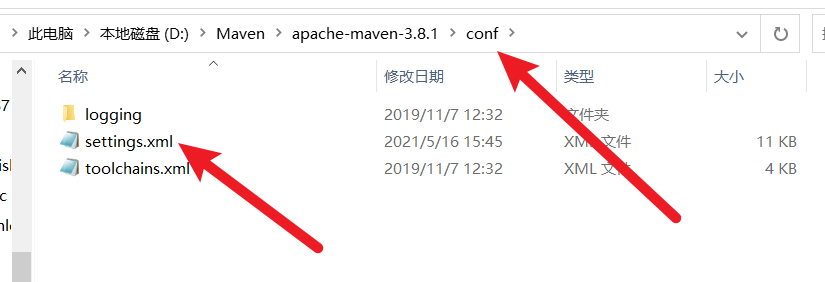

# Maven安装配置


## 1. Maven项目架构管理工具


## 2. 下载安装Maven

https://maven.apache.org/download.cgi


**下载完成后，解压**

==尽量把电脑上的所有环境放在一个文件夹下==

mirrors（镜像）：方便下载使用

## 3. 配置环境变量

==配置如下==

- M2_HOME		  maven目录下的bin
- MAVEN_HOME   maven的目录
- path里面配置： %MAVEN_HOME%\bin


**配置成功：**


## 4. 阿里云镜像

- 镜像：mirrors
  - 作用：加速我们的下载
- 国内建议用阿里云镜像

**全局配置**
添加阿里云的镜像到maven的setting.xml配置中，这样就不需要在每个pom中都添加镜像仓库的配置，在mirrors节点下面添加子节点：

```xml
<mirror>      
	  <id>nexus-aliyun</id>    
	  <name>nexus-aliyun</name>  
	  <url>http://maven.aliyun.com/nexus/content/groups/public</url>    
	  <mirrorOf>central</mirrorOf>      
	</mirror>

```




## 5. 本地仓库

在本地的仓库，远程仓库；

**建立一个本地仓库：**localRepository

```xml
  <localRepository>D:\Maven\apache-maven-3.8.1\maven-repo</localRepository>
```


## 6. 在Idea中使用Maven

- 启动IDEA
- 创建一个Maven项目
- 


==创建成功==


- $\textcolor{red}{搭建成功看项目多了什么东西}$

- ==IDEA中的Maven设置==

  - 注意：IDEA项目创建成功后看一眼Maven的配置

  - 

    


**到这里，Maven的配置和使用就OK了**

## 7. 创建一个普通的maven项目


## 9. 在IDEA中配置Tomcat

 


==解决问题==


**不写默认访问路径：localhost:8080**

**假如写了：**

## 10. pom文件

pom.xml 是Maven的核心配置文件


# $\textcolor{red}{Maven的高级之处在于，它会帮你导入这个JAR包所依赖的其他地方}$

==约定大于配置==


在项目依赖下面加一个resource

==搜索Maven资源导出==


# eclipse中创建maven


