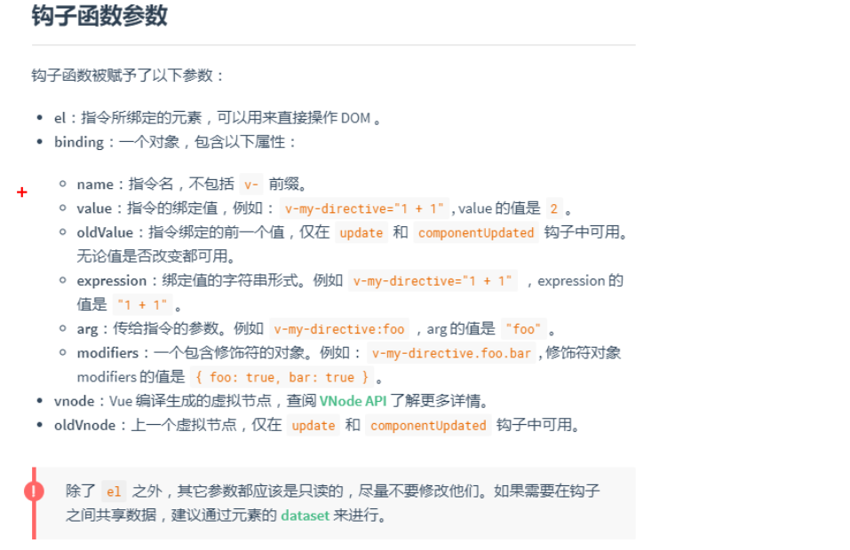
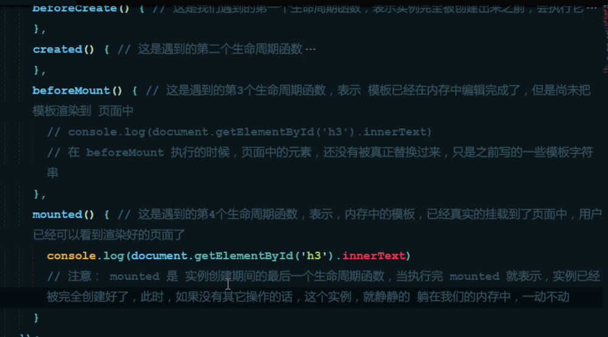
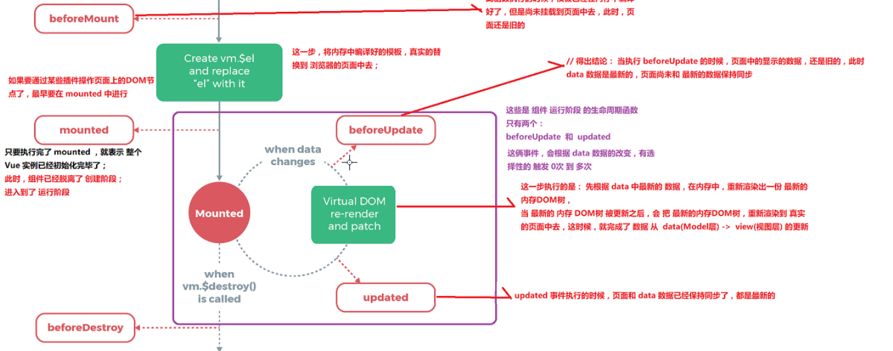
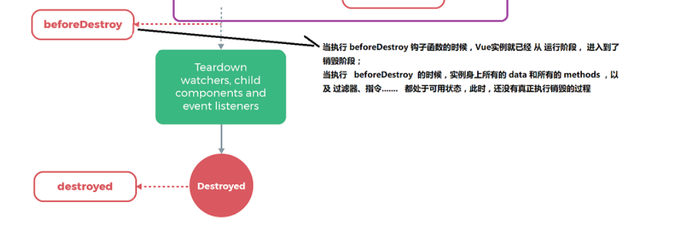

## MVVM 和 MVC的区别

mvvm是前端的思想

mvc是后端的思想，但是把前端也给考虑进去了。


## vue的基本代码和 MVVM 之间的对应关系


## Vue的自带属性

1. el 这里是将id等拿到
2. data 这里面是写各种属性的地方
3. methods 方法属性


## Vue指令

### v-cloak （插值闪烁）和 v-text

当你在网络不好的时候，刷新页面的话，有可能会把你new的实例里面的data方法的数据调用显示出来，比如{{message}}，然后刷新成功以后，才会显示成功。

这个指令就是解决<font color='red'>插值表达式闪烁的问题</font>，一般配合 ，display：none 使用。

```html
<style> 
	[v-cloak] {
		display: none;
	}
</style>
// 如果这里不隐藏的话，在刷新的过程中，就是显示上次页面这个数据显示的东西
<div id="app"> 
	<p v-cloak>+++++++++{{message}}_____</p> // +++++++123___
  <h4 v-text="message"> // 123
    ------------
  </h4>
</div>
```

+ 默认v-text是没有闪烁问题的

+ v-text会覆盖元素原本的内容，但是  插值表达式，<font color='cornflowerblue'>只会替换自己的占位符</font>，不会把  整个元素的内容清空。

<font color='green'>所以，我们在使用指令的时候，如果想要一个元素的内容被覆盖掉，我们就可以使用v-text，v-cloak的话，就是为了防止元素在刷新的过程中，出现显示插入语句  </font><font color='red'>也就是防止插值表达式闪烁问题</font>

 ### v-html和v-text

v-html 可以解读数据里面的标签，而v-text不可以

他们两个都会覆盖掉元素的内容

```html
<div id="app">
  <div v-text="message2">----</div> // 就会把标签一下显示出来
  <div v-html="message2">----</div> // 这个的话就会解析标签，都会覆盖掉标签里面的元素内容。
</div>

<script>
    new Vue({
      el: "#app",
      data: {
        message: '123',
        message2: '<h1>哈哈哈哈哈哈哈 </h1>'
      }
    })
  </script>
```

### v-bind 绑定属性

当你一个属性要说明你引用的是变量名的时候，就需要用到这个，<font color='red'>v-bind是用于绑定属性的指令</font>

```html
<div id="app">
  <input type="button" value="按钮" v-bind:title="myTitle + '123'"> // this is a title123
</div>

new Vue({
	el: '#app',
	data:{
		myTitle: 'this is a title'
}
})
```

当你鼠标防止到按钮的时候，就会通过调用变量名，然后显示变量里面的语句， 

<font color='red'>在变量的后面可以通过字符串拼接的方式，就是合法的js表达式</font>

#### v-bind的语法糖

<font color='orange'>就是把v-bind给去除掉，只留下一个:</font>

```html
<input type="button" value="按钮" :title="myTitle + '123'"> // this is a title123
```

### v-on 事件绑定

<font color='cornflowerblue'>v-on也就是绑定事件的指令
</font>

比如用于绑定什么点击事件啊，鼠标覆盖等等，不用再去操作dom元素，比如，

```html
document.getElementById("app").onclick = function() {

}
```

现在只需要在里面直接调用我们写好的方法就可以了

```js
<!-- v-on 事件绑定机制 -->
  <div id="app">
    <input type="button" value="按钮" :title="myTitle" v-on:click="show">

  </div>
  <script>
    var app = new Vue({
      el: '#app',
      data: {
        myTitle: 'this is a title ',

      },
      methods: { // 这和methods属性中定义了当前Vue实例所有可用的方法。
        /* show() {
          alert('hello')
        } */
        show: function () {
          alert('hello')
        }
      }


    })
  </script>
```

在你绑定好的事件里面，你不能直接写 alert('hello')  因为它和v-bind一样，是去调用方法，不能直接去编译语句。

<font color='red'>不然就会显示错误  说你属性或者方法没有找到</font>

```html
 <input type="button" value="按钮" :title="myTitle" v-on:click="alert('hello')">


vue.js:634 [Vue warn]: Property or method "alert" is not defined on the instance but referenced during render. Make sure that this property is reactive, either in the data option, or for class-based components, by initializing the property. See: https://vuejs.org/v2/guide/reactivity.html#Declaring-Reactive-Properties.

(found in <Root>)
```

#### v-on语法糖

v-on的语法糖 形式为  就是加一个   @  把v-on换为这个


### 走马灯案例

也就是实现文字的轮播，就是截取第一个字符串和剩下的字符串，然后后面的字符串，加上截取的第一个字符串，就能实现此功能。

```html
<div id="app">
    <input type="button" value="浪起来" @click="change">
    <input type="button" value="不浪了" @click="pause">

    <h4>{{message}}</h4>

  </div>

<script>
	var app = new Vue({
    el: '#app',
    data: {
			message: '点击浪起来~~！！',
      setInterValId: null // 用于控制定时器
    },
    methods:{
     	change() {
        
       if (this.setInterValId != null) {
           	return ; // 加入已经定时器运行了一次以后，那么以后再次点击 ，就不会有任何的效果。
           } 
        
        // 这里就有了个问题，this指向的问题
        // 假如不使用箭头函数的话，使用this的话，就会指向我们的setInterVal这个方法，所以我们可以在外面使用一个变量将this给装起来。
        // var _this = this; 然后将里面的每一个this给换为_this
        this.setInterValId = setInterval(() => {
          	var start = this.message.substring(0,1);
          	vat end = this.message.substring(1);
          	this.message = end + start; // 这里使用后面的加上前面截取的，就出现了 一种是轮播的效果，以后可以加上滑动这种效果。
        }, 400)
      } 
    },
    pause() {
      // 关闭定时器，并且重置定时器的返回值
      cleatInterVal(this.setInterValId);
      this.setInterValId = null;
    }
  })
</script>
```

<font color='red'>要想在vue 里面拿到data里面的属性，那么你就必须要使用this才可以。</font>

### 事件修饰符

#### .stop 阻止冒泡

```html
 <!-- 阻止冒泡 .stop -->
 <!-- 在这里点击按钮的话，就会产生冒泡 -->
 <div class="box" @click="divClick"> <input type="button" value="按钮" @click.stop="btnClick"> </div> divClick() {
 console.log("这里是div"); }, btnClick() { console.log("这里是btn按钮"); }
```

#### .self 只有自己才能发生事件

```html
<div class="box" @click.self="divClick">
  <input type="button" value="按钮" @click="btnClick"> 
</div>
```

<font color='red'>.stop 和 .self 的区别，前者是阻止冒泡，后者是，阻止别人来用你的东西，只能自己使用自己的东西。</font>

在.self外还有的话，也是可以冒泡的

#### .prevent(阻止默认事件) 和 .once

```html
  <!-- 阻止默认事件  比如a标签，可以进行页面跳转 --> <a href="http://www.baidu.com" @click.prevent.once="aClick">去百度</a>aClick() {
  console.log("我要跳转去百度,但是我被阻止了.prevent,但是我加了once以后，我只被阻止了一次"); }
```

<font color='orange'>.prevent.once  这两个可以联合使用，</font>

**.once 也就是只能将前置条件阻止一次。 以后它就管不到了**

#### .capture 捕获

```html
<!-- 阻止默认事件  比如a标签，可以进行页面跳转 --> <a href="http://www.baidu.com" @click.prevent.once="aClick">去百度</a>
<!--捕获机制，就是从外向内 -->
<div class="caputerBox" @click.capture="boxCapture">
  <div class="box" @click="divClick"> <input type="button" value="我被父盒子捕获" @click="btnCaptuer"> </div> // 捕获
  boxCapture() { console.log("我要捕获我的孩子"); }, btnCaptuer() { console.log("我被捕获了"); }
```

 

<font color='red'>捕获就是从外向内，添加到最外部。</font>

### v-model 表单的双向绑定

<font color='red'>只能用于在表单元素中， </font>比如 input(radio,text,address,email....)select checkbox textarea

<font color='orange'>v-bind 只能实现数据的单向绑定，从M自动绑定到V，无法实现数据的双向绑定</font>

使用 v-model指令，可以实现 表单元素和model 中数据的双向数据绑定

```html
<div id="app">
  <p>{{message}}</p> <input type="text" v-model:value="message">
</div>
<script>
  var app = new Vue({
    el: '#app',
    data: {
      message: '我要数据的双向绑定'
    }
  })
</script>
```

### v-for指令 循环遍历

<font color='red'>这个可以实现循环遍历，就是实现遍历，</font>

1. 循环普通数组

   ```html
   <div id="app">
     <!-- 循环遍历数组，不在需要一个一个的通过下标来了 -->
     <p>{{list[0]}}</p> <!-- 这里也可以，拿到对应下标的值 -->
     <p v-for="item in list">{{item}}</p> <!-- 这里如果没有打{{}}的话，就会出现输出循环遍历list长度的item和i出来 -->
     <p v-for="(item, i) in list">值为: {{item}} --下标为: {{i}}</p>
   </div>
   <script>
     var app = new Vue({
       el: '#app',
       data: {
         list: [1, 2, 3, 4, 5]
       }
     })
   </script>
   ```

   

2. 循环遍历数组对象

   ```html
   <div id="app">
     <!-- 循环遍历数组，不在需要一个一个的通过下标来了 -->
     <p>{{list[0]}}</p> <!-- 这里也可以，拿到对应下标的值 -->
     <!-- // 这样的话就是遍历的整个对象 -->
     <p v-for="item in list">{{item}}</p> <!-- 这里如果没有打{{}}的话，就会出现输出循环遍历list长度的item和i出来 -->
     <p v-for="(item, i) in list">姓名为: {{item.name}}--年龄为:{{item.age}} --下标为: {{i}}</p>
   </div>
   <script>
     var app = new Vue({
       el: '#app',
       data: {
         list: [{
           'name': 'zhangsan',
           'age': '11'
         }, {
           'name': 'lisi',
           'age': '11'
         }, {
           'name': 'wangmazi',
           'age': '11'
         }, {
           'name': 'zhaoliu',
           'age': '11'
         }]
       }
     })
   </script>
   ```

   

3. 循环对象

   <font color='red'>这里循环对象的时候，遍历的第一个为值value，第二个为键key，第三个为下标</font>

   ```html
   <body>
     <div id="app">
       <p v-for="item in user">{{item}}</p> <!-- 循环遍历对象的时候，第一位表示的是值，第二位表示的是键，第三位标的是下标，很少使用 -->
       <p v-for="(value,key,i) in user">--值为：{{value}} --键为:{{key}} -- 下标:{{i}}</p>
     </div>
     <script>
       var app = new Vue({
         el: '#app',
         data: {
           user: {
             'name': 'zhangsan',
             'age': '22'
           }
         }
       })
     </script>
   ```

4. 迭代数字

   ```html
   <div id="app">
     <!-- 遍历数字的话，下标是从0开始的，但是遍历的数字是从1开始，一直到10 -->
     <p v-for="item in 10">{{item}}</p>
     <p v-for="(item,i) in 10">{{item}} -- {{i}}</p>
   </div>
   <script>
     var app = new Vue({
       el: '#app',
       data: {}
     })
   </script>
   ```


<font color='orange'>特殊
</font>

 + 在2.2.0+ 的版本里，当在组件中使用v-for时，key现在是必须的。
   + 当使用v-for正在更新已渲染过的元素列表的时候，默认“就地复用”策略。 <font color='red'>就像是下面的案例，复选框一样，当你更新数据的时候，他选择的是已有的第三个，就是“就地复用”的意思</font>
+ <!-- key装的是一个变量，所以需要使用v-bind来绑定 -->
      <!-- 注意： v-for循环的时候，key属性只能使用 number获取String -->
      <!-- 注意： key在使用的时候，必须使用v-bind属性绑定的形式，指定key的值， -->
      <!-- 在组件中，使用v-for循环的时候，或者在一些特殊情况中，如果v-for有问题，必须在使用v-for的同事，指定唯一的字符串/数字 类型 :key 值 -->
+ 也就是说，当你在使用key的时候，里面不能是一个变量。里面必须是一个字符，或者是一个数字，也可以使用对象的调用里面的值
+ <font color='red'>key也就是用于保证数据的唯一性。</font>

```html
<div id="app">
  <div> <label for="">
      <!-- 双向绑定数据 --> id： <input type="text" v-model="id"> </label> <label for=""> name： <input type="text"
        v-model="name"> </label> <input type="button" value="添加" @click="add"> </div>
  <!-- key装的是一个变量，所以需要使用v-bind来绑定 -->
  <!-- 注意： v-for循环的时候，key属性只能使用 number获取String -->
  <!-- 注意： key在使用的时候，必须使用v-bind属性绑定的形式，指定key的值， -->
  <!-- 在组件中，使用v-for循环的时候，或者在一些特殊情况中，如果v-for有问题，必须在使用v-for的同事，指定唯一的字符串/数字 类型 :key 值 -->
  <!-- 这个可以用来保证数据的唯一性。 -->
  <p v-for="item in user" :key="item.id"> <input type="checkbox" name="" id=""> ---- {{item.id}} --{{item.name}} </p>
</div>
<script>
  var app = new Vue({
        el: '#app',
        data: {
          user: [{
            id: '1',
            name: '小蒋'
          }, {
            id: '2',
            name: '小小蒋'
          }, {
            id: '3',
            name: '小小小蒋'
          }, {
            id: '4',
            name: '小小小小蒋'
          }, ],
          id: '',
          name: ''
        },
        methods: {
          add() { // this.user.push({  // 当我这里更换以后，我以前选择框选中的为第三个，我这个加在最前面以后 ，就把我选中的第三个挤下去了，那么就是，以前的第二个被选择上了，所以我们这里就需要添加一个key来把他固定                    this.user.unshift({                        id: this.id,                        name: this.name                    })                }            }
```


### v-if 和 v-show的使用 判断

<font color='red'>就是用来表示判断的</font>

<font color='orange'>v-if有较高的切换性能消耗</font>

<font color='orange'>而v-show的话, 有较高的初始渲染消耗</font>

```html
<div id="app"> <input type="button" value="切换" @click="flag = !flag"> <!-- 在切换的过程中，v-if的话就是把整个标签都重新创建与删除 -->
  <!-- 而v-show的话，就是加一个切换样式display:none 将之给隐藏起来。而不是重新进行dom的删除和创建操作， -->
  <!-- 由此可以得出结论， v-if有较高的切换性能消耗 -->
  <!-- 而v-show的话, 有较高的初始渲染消耗 -->
  <!-- 如果你涉及到频繁的切换的话,你就使用v-show,只需要初始化,最初是的一次就可以了 -->
  <!-- 如果一个元素可能永远也不会被显示出来你被用户看到的话,那么就推荐使用,v-if  因为,你加入一直看不见的话,使用v-show的话,就会自动初始化一个,然后在那里一直隐藏,消耗内存,使用if就没这个问题,只需要在使用的时候,在创建一个就是了 -->
  <p v-if="flag ">我是v-if控制的</p>
  <p v-show="flag ">我是v-show控制的</p>
</div>
<script>
  var app = new Vue({
    el: '#app',
    data: {
      flag: true
    }
  })
</script>
```


## 设置样式

### 通过属性绑定为元素设置class类样式

<font color='red'>有两种方法： 使用class样式，使用内联样式</font>


```html
<div id="app">
  <!-- 使用数组 -->
  <!-- 需要使用属性绑定class，才可以在vue中使用 -->
  <!-- 必须使用数组将它装起来 -->
  <h1 class="red thin">我是老版的</h1>
  <h1 :class="['red','thin']">我是一个很大很大的H1，并且我还可以变红</h1> <!-- 使用三元表达式 -->
  <h1 :class="['red','thin', flag? 'active' : '']">我是一个很大很大的H1，并且我还可以变红还有很大的间距</h1> <!-- 使用对象的写法 -->
  <h1 :class="['red','thin', {active:true}]">我是一个很大很大的H1，并且我还可以变红还有很大的间距</h1> <!-- 直接使用对象 -->
  <h1 v-bind:class="{red:true,italic:true}">我是使用对象装的h1</h1>
  <script>
    var app = new Vue({
      el: '#app',
      data: {
        flag: false,
        color: 'green',
        size: '30px'
      },
      methods: {}
    })
  </script>
```

 <font color='orange'>使用绑定属性 绑定对象的时候，对象的属性是类名，由于对象的属性是类名，由于对象的属性可带引号，也可以不带</font>

### 通过属性绑定为元素设置内联样式

就是在元素上通过 :style 来设置样式

<font color='red'>注意，如果里面的属性名称，包含横线，必须加 ' '  比如 'font-size'</font>

```html
  <!-- 使用内联样式 -->
  <h1 :style="{color:'red','font-size':'30px'}">我是使用内联样式</h1> <!-- 使用对象的方式，将值传入vue实例的属性里面-->
  <h1 :style="styleobji">我使用的data</h1> <!-- 可以给属性里面指定数组。 -->
  <h1 :style="[styleobji1, styleobji2]">我使用的data</h </div> <script> var app = new Vue({ el: '#app', data: { flag: false,
    color: 'green', size: '30px', styleobji: {color:'red','font-size':'30px'}, styleobji1:{color:'green'},
    styleobji2:{'font-weight': '700'} }, methods: {} }) </script>
```

## 过滤器

过滤器就是用于更改数据的，

<font color='cornflowerblue'>必须写在new的Vue实例之前才可以</font>

<font color='red'>定义的格式: {{ name | 过滤器的名称}}</font>

**这个一定是写在script里面的**

```html
<div id="app">{{msg | 过滤器的名称}}</div>
<script>
  var app = new Vue({
    el: '#app',
    data: {
      msg: '我是用来测试过滤器的，我通过管道调用，方法，来实现更改数据信息'
    }
  }) 
  Vue.filter('过滤器的名称', function (过滤器前面的参数) {})
</script>
```

**使用**

<font color='red'>这里我们要注意几个点：</font>

+ 就是你在写过滤器的时候，方法名就是一个方法名，后面的回调函数里面，第一个参数默认的表示的是，你的管道前面的数。
+ 第二个就是，可以有多个形参，在默认的参数后面，并且不管多少个都是可以的。
+ 第三个就是，过滤器必须在你new的Vue实例之前才可以。

```html
 <div id="app">
  <!-- 这里不写数据，下面接受到的第一位就是你前面的数据 -->
  <p>{{msg | msgFormat}}</p> <!-- 可以传参数 -->
  <p>{{msg | msgChange('zhangsan')}}</p>
</div>
<script>
  // 第一位必须固定是为，你管道前面的数据，即使你不写，他也会默认是你前面的参数         Vue.filter('msgFormat',function(msg) {            return msg + '123'        })       
  // 这里只写名字，不需要写传进来的参数这些，后面的回调函数里面，才需要写参数这些        
  // 这里的回调函数，就相当于是方法的定义，里面的都是形参，外面就是在调用这个        Vue.filter('msgChange', function(msg, arg) {            
  // 这里进行了替换， 也可以写作正则表达式的形式，            
  // return msg.replace('测试', '======') + arg;   
  return msg.replace(/测试/g, '=====') + arg; 
  //  /测试/g 表示匹配全局，然后找到里面相同的东西，然后在进行替换        })          var app = new Vue({            el: '#app',            data: {                msg: '我是用来测试过滤器的，我通过管道调用，方法，来实现更改数据信息'            }        })    
</script>
```

### 定义格式化时间的全局过滤器

```html
<div id="app">{{ date | showDate("yyyy-MM-dd") }}</div>
<script>
  // 设置默认值        
  Vue.filter('showDate', function (date, pattern = '') { // 没有传参数进来，就调用的是下面的else           
        var y = date.getFullYear();
        var m = date.getMonth() + 1;
        var d = date
      .getDate(); // 当我没有传参进来的时候，就会出现以下错误。            // Cannot read property 'toLowerCase' of undefined"            // 
        if (pattern.toLowerCase() === 'yyyy-MM-dd') {
          if (pattern && pattern.toLowerCase() === 'yyyy-MM-dd') { // 这样就不会有问题了，还有一种就是，直接赋值到变量上去               
            console.log(pattern);
            return `${y}-${m}-${d}`;
          } else {
            var hh = date.getHours();
            var mm = date.getMinutes();
            var ss = date.getSeconds();
            console.log(pattern + 2);
            return `${y}-${m}-${d} ${hh}:${mm}:${ss}`;
          }
        }) 
        var app = new Vue({
        el: '#app',
        data: {
          date: new Date()
        }
      })
```

<font color='cornflowerblue'>上面代码出现了几种新出现的
</font>

+ 过滤器，形参列表里面写了参数的话，你可以使用==es6==语法，直接在形参那里直接定义初始化，**那么即使你不调用，你也可以运行，因为有初始化值**
+ 你也可以使用逻辑运算符，比如这样
  + pattern && pattern.toLowerCase() === 'yyyy-MM-dd'
+ 在你返回值，调用参数和拼接的时候 ，你可以通过 **``** 然后加在这两个里面，通过 **${}** 来调用参数。

### 私有过滤器的定义

<font color='red'>所有的全局过滤器，就是全部都能用
</font>

在vue实例里面加入 **filters:{}**  对象

**你本地有私有的话，你就先访问自己私有的，就近原则嘛**

```html
 <div id="app"> {{date | showDate}} </div>
<script>
  var app = new Vue({
    el: '#app',
    data: {
      date: new Date()
    },
    filters: {
      showDate: function (date, pattern = '') {
        var y = date.getFullYear();
        var m = date.getMonth() + 1;
        var d = date.getDate();
        if (pattern && pattern.toLowerCase() === 'yyyy-MM-dd') {
          console.log(pattern);
          return `${y}-${m}-${d}`;
        } else {
          var hh = date.getHours();
          var mm = date.getMinutes();
          var ss = date.getSeconds();
          console.log(pattern + 2);
          return `${y}-${m}-${d} ${hh}:${mm}:${ss}`;
        }
      }
    }
  })
```

<font color='red'>注意，在filter里面，就相当于是写的方法，那么你就需要写位：   showDate: function (date, pattern = '')     或者es6的写法  showDate(date,pattern='')</font>

### 使用 padStart()方法

**使用es6中的字符串新方法，String.property.padStart(maxLength, fillString=' ') 或者 .padEnd()，来填充字符串**

这种用于比如 你获取当前时间，然后格式化了时间， 但是在这之中，可能会出现，小于10的数字，就只会出现一位，那么在现实应用中，肯定是要加上0的，所以我们就可以使用，padStart方法。在开始的位置加上一个0，这个方法，空字符，0，字符这些都可以表示，第一位是最大的长度。

```html
 var hh = date.getHours().toString().padStart(2,'0');                        var mm = date.getMinutes().toString().padStart(2,'0');                        var ss = date.getSeconds().toString().padStart(2,'0') ;
```


## 自定义

### 自定义全局==按钮==修饰符

**有时候会用到，比如你登录的时候，一下子回车，就直接登录了 **

那么这个时候，我们就可以用到键盘事件了  在配合 **vue的事件修饰符** 

**比如你要绑定enter**

@keyup.enter="add"

```html
<p @keyup.enter="add"></p>
```

**vue里面就提供了几种按钮**

​	+  .enter .tab .delete(捕获删除和退格键) .esc .space .up .down .left .right 

你可以用ASCII码来表示， **@keyup.112 = "add"**

<font color='red'>如果你想要绑定其他的按钮修饰符</font>

```html
Vue.config.keyCodes.f1 = 112
```

然后你就可以直接调用

```html
@keyup.f1
```

**上面说的是2.x版本的写法，1.x很少用了，毕竟版本的更新 **

### 自定义全局==指令==

也就是定义一些事件，比如说自动获得焦点呀，什么什么的

<font color='red'>使用Vue.directive()来定义全局指令，不需要带v- </font>

<font color='red'>里面有两个参数，第一个是固定的，指令的名称 第二个是对象，存储带有不同阶段工作，不同性能的方法</font>

```html
<div id="app"> 自动获取焦点<input type="text" v-focus> </div>
<script>
  // 使用 Vue.directive() 定义全局的指令。 里面就是你要自定义的事件    
  // 但是你这里面不需要写v- 什么什么的，因为Vue自动给你装好了的，但是在你调用的时候，就要使用 v-什么什么的    
  // 其中: 参数1为： 指令的名称，并且在定义的时候，只能为参数的名称，    
  // 参数2： 是一个对象，这个对象身上，有一些指令相关的函数，这些函数有自己具体的功能，并且在特定的阶段，执行特定的任务 
  Vue.directive('focus', {
    bind(el) {
      // 每当指令绑定在元素上的时候，会立即执行这个bind函数，只执行一次        
      // 注意： 在每个 函数中，第一个参数，永远是 el ，表示 被绑定了指令的那个元素，这个 el 参数，是一个原生的JS对象        		 // 在元素 刚绑定了指令的时候，还没有 插入到 DOM中去，这时候，调用 focus 方法没有作用       
      //  因为，一个元素，只有插入DOM之后，才能获取焦点       
      // el.focus()      },      inserted: function (el) {  
      // inserted 表示元素 插入到DOM中的时候，会执行 inserted 函数【触发1次】      
      el.focus()
      // 和JS行为有关的操作，最好在 inserted 中去执行，放置 JS行为不生效     
    },
    updated: function (el) {
      // 当VNode更新的时候，会执行 updated， 可能会触发多次      
    }
  })
  var app = new Vue({
    el: '#app',
    data: {}
  })
</script>
```


**定义color颜色**

```html
<div id="app"> 自动获取焦点<input type="text" v-focus v-color> // 可以自己设定颜色 自动获取焦点<input type="text" v-focus v-color="'blue'">
</div>
<style>
  Vue.directive('color', {
      bind(el) {
        // 这是没有参数      el.style.color = 'blue';    }	})
</style>
```

**bind**  在内存中调用

**inserted** 从内存渲染到页面中，然后操作dom元素，在页面中调用

<font color='red'>也就是和js行为相关的操作，最好是方法哦inserted里面， </font><font color='cornflowerblue'>和样式相关的，一般放到bind中，因为，不管元素有没有输入信息，bind是从内存中调用的，就直接相当于给那个标签 赋了一个内联样式</font>




#### 自定义指令的时候，拿到值

**自定义color颜色**

<font color='red'>在传参的时候，是有要求的，就是必须是双引号包裹单引号，然后在写自己的值</font>

```html
<div id="app"> // 可以自己设定颜色 自动获取焦点<input type="text" v-focus v-color="'blue'"> </div>
<script>
  Vue.directive('color', {
        bind(el, binding) { // 这里不需要是写binding才可以，因为这是形参，写什么都可以。      el.style.color = binding.value    }	})
</script>
```

**由上面的图可以知道，我们的钩子函数的第二个参数为,bingding,里面有不同的属性，比如 binding.name  就是得到设置的指令的名称**

<font color='red'>其中有两个，binding.value  和 binding.expression 这两个的话，第一个是具有计算属性的，就比如你传进来的值为： '1+1' ，它会给你算作是2， 但是后面一个的话，就是传进来的值</font>

**所以我们要自定义颜色的话，就需要使用第一个才可以，因为我们传进来的时候，是使用了单引号包裹的，我们就必须将其单引号给去除**

### 自定义私有指令

就是在Vue实例里面定义。directives:{} 

**注意是 directives **

```html
<div id="app">
  <!-- // 可以自己设定颜色 -->
  <p v-fontweight="900">自动改变字体大小</p>
</div>
<script>
  var app = new Vue({
    el: '#app',
    directives: {
      'fontweight': {
        bind(el, binding) {
          el.style.fontWeight = binding.value;
        }
      }
    }
  })
```

### 指令函数的简写行式

在许多情况下，您可能希望在`bind`and上具有相同的行为`update`，但不关心其他钩子。例如：

```js
Vue.directive('fontsize', function (el, binding) {  el.style.fontSize = parseInt(binding.value) + 'px';})
```

**注意：这个function就等同于把代码写到了bind和update中去**

## 生命周期

### Vue==实例==的生命周期

生命周期钩子 = 生命周期函数 = 生命周期事件

#### 分类

+ 什么是生命周期：从Vue实例创建、运行、到销毁期间，总是伴随着各种各样的事件，这些事件，统称为生命周期！
+ [生命周期钩子](https://cn.vuejs.org/v2/api/#选项-生命周期钩子)：就是生命周期事件的别名而已；
+ 生命周期钩子 = 生命周期函数 = 生命周期事件
+ 主要的生命周期函数分类：

 - 创建期间的生命周期函数：

```
+ beforeCreate：实例刚在内存中被创建出来，此时，还没有初始化好 data 和 methods 属性（表示的是在实例完全还没被创建出来之前，会执行它。）+ created：实例已经在内存中创建OK，此时 data 和 methods 已经创建OK(如果要调用methods中的方法，最早只能在created中操作)，此时还没有开始 编译模板+ 编译模板： 表示Vue开始编辑模板，把Vue代码中的那些指令进行执行，最终，在内存中生成一个编译好的最终模板字符串，然后，把这个模板字符串，渲染为内存中的DOM，此时，只是在内存中，渲染好了模板，并没有把模板挂载到真正的页面中去。+ beforeMount：此时已经完成了模板的编译，但是还没有挂载到页面中+ mounted：此时，已经将编译好的模板，挂载到了页面指定的容器中显示
```


<font color='red'>如果要通过某些插件操作页面上的DOM节点，最早要在mounted中进行，只要执行完了mounted，就表示整个Vue实例已经初始化完毕了。此时组件已经脱离了创建阶段；进入到了运行阶段</font>



 - 运行期间的生命周期函数：

```apl
+ beforeUpdate：状态更新之前执行此函数， 此时 data 中的状态值永远是最新的，但是界面上显示的 数据还是旧的，因为此时还没有开始重新渲染DOM节点+ updated：实例更新完毕之后调用此函数，此时 data 中的状态值 和 界面上显示的数据，都已经完成了更新，界面已经被重新渲染好了！
```

**这两数据会根据数据的改变有选择性的根据数据的改变，触发0次或无数次**




 - 销毁期间的生命周期函数：

```apl
+ beforeDestroy：实例销毁之前调用。在这一步，实例仍然完全可用。+ destroyed：Vue 实例销毁后调用。调用后，Vue 实例指示的所有东西都会解绑定，所有的事件监听器会被移除，所有的子实例也会被销毁。
```





## [vue-resource 实现 get, post, jsonp请求](https://github.com/pagekit/vue-resource)

除了 vue-resource 之外，还可以使用 `axios` 的第三方包实现实现数据的请求

1. 之前的学习中，如何发起数据请求？
2. 常见的数据请求类型？  get  post jsonp
3. 测试的URL请求资源地址：

 + get请求地址： http://liulongbin.top:3005/api/getlunbo
 + post请求地址：http://liulongbin.top:3005/api/post
 + jsonp请求地址：http://liulongbin.top:3005/api/jsonp

<font color='red'>在发送post请求的时候，要设置普通表单格式，</font>

```html
2. this.$http.post() 中接收三个参数：  
2.1 第一个参数： 要请求的URL地址  
2.2 第二个参数： 要提交给服务器的数据 ，要以对象形式提交给服务器 { name: this.name }  
2.3 第三个参数： 是一个配置对象，要以哪种表单数据类型提交过去， { emulateJSON: true }, 以普通表单格式，将数据提交给服务器 application/x-www-form-urlencoded
```


4. JSONP的实现原理

 + 由于浏览器的安全性限制，不允许AJAX访问 协议不同、域名不同、端口号不同的 数据接口，浏览器认为这种访问不安全；
 + 可以通过动态创建script标签的形式，把script标签的src属性，指向数据接口的地址，因为script标签不存在跨域限制，这种数据获取方式，称作JSONP（注意：根据JSONP的实现原理，知晓，JSONP只支持Get请求）；
 + 具体实现过程：

 	- 先在客户端定义一个回调方法，预定义对数据的操作；
 	- 再把这个回调方法的名称，通过URL传参的形式，提交到服务器的数据接口；
 	- 服务器数据接口组织好要发送给客户端的数据，再拿着客户端传递过来的回调方法名称，拼接出一个调用这个方法的字符串，发送给客户端去解析执行；
 	- 客户端拿到服务器返回的字符串之后，当作Script脚本去解析执行，这样就能够拿到JSONP的数据了；

#### 全局配置

```html
// 设置全局配置  这里是在vue.resource下面的  就相当于设置 相同的路径
    Vue.http.options.root = "http://liulongbin.top:3005/";
    // 注意： 这里请求的数据接口的根域名 ，在每次单独发起 http请求的时候，请求的url路径，应该以相对路径靠头，前面不能带 / ，否则或出现启用本地主机localhost做拼接
 
    // 设置 emulateJSON  全局选项。
    Vue.http.options.emulateJSON = true;
```


## 组件

### 组件的定义

**第一种方式**

使用Vue.extend({}) 实现

```html
 <div id="app">

    <mycom1></mycom1>
  </div>

  <script>
    // 定义组件的第一种方式。
    var com1 = Vue.extend({
      template: '<h1>我这是使用Vue.extend方式创建的</h1>'
    })
    // 注意这里如果是写的驼峰命名规则的话，那么就需要在当做使用这个名字作为标签的时候，需要变为在数据库里面那样， -加单词
    Vue.component('mycom1', com1) // 这里的第一个参数为你定义的标签名，第二个为创建的组件模板对象

    var app = new Vue({
      el: '#app',
      data: {}
    })
  </script>


 <script>
    // 定义组件的第二种方式。
    Vue.component('mycom1', Vue.extend({
      template: '<h1>我这是使用Vue.extend方式创建的</h1>'
    })) // 这里的第一个参数为你定义的标签名，第二个为创建的组件模板对象

    var app = new Vue({
      el: '#app',
      data: {}
    })
  </script>
```


省略掉Vue.extend()

```html
  <script>
    // 定义组件的第二种方式。
    Vue.component('mycom1', {
      template: '<div><h1>我这是使用Vue.extend省略的方式创建的</h1><span>123</span></div>'
    }) // 这里的第一个参数为你定义的标签名，第二个为创建的组件模板对象

    var app = new Vue({
      el: '#app',
      data: {}
    })
  </script>
```

<font color='red'>但是以上两种写法会出现，在你写标签的时候，不会给你提示，这是局限性</font>

<font color='orange'>并且局限于只能使用一个大标签包裹住才可以，不然会报错</font>

```ABAP
Component template should contain exactly one root element. If you are using v-if on multiple elements, use v-else-if to chain them instead.

意思是必须要有根标签才可以。
```

**创建方式三**

```html
 <div id="app">

    <mycom3></mycom3>
  </div>

  <template id="com3">
    <div>
      <h1>我是通过template元素，在外部定义的组件结构，这个方式有代码的智能提示和高亮</h1>
      <span>直接用，但是还是需要有根标签才可以。</span>
    </div>
  </template>

  <script>
    // 定义组件的第三种方式。
    Vue.component('mycom3', {
      template: '#com3'
    })

    var app = new Vue({
      el: '#app',
      data: {}
    })
  </script>
```

**这是全局属性，你都可以使用**

### 定义私有组件

```html
  <div id="app">

    <login></login>
  </div>

  <template id="priv">
    <div>
      <h1>私有组件的创建</h1>
    </div>
  </template>

  <script>
    var app = new Vue({
      el: '#app',
      data: {},
      // 定义私有组件
      components: {
        login: {
          // tempalte: '<h1>固定的定义私有组件</h1>'
          template: '#priv'
        }
      }
    })
  </script>
```

<font color='red'>就是在其中加一个components:{} 对象属性。然后在里面定义</font>

### 组件中的data和methods

<font color='red'>在组件中定义这些与vue实列中的一样的对象属性，也就是说明，我们在使用组件标签的时候，可以在标签里面，像是调用实例的属性和方法那样。 {{msg}}</font>

<font color='blue'>data是特殊的，必须要写为是 data: function()才可以，并且要返回一个对象才可以，例如</font>

```html
  <div id="app">
    <counter></counter>
  </div>

  <template id="com1">
    <div>
      <input type="button" value="+1" @click="increment">
      <p>{{count}}</p>
    </div>
  </template>

  <script>
    // 实现每点一次，count+1
    Vue.component('counter', {
      template: '#com1',
      // 这里面的data必须写为function的形式i，定义为一个方法
      data: function () {
        return {
          count: 0
        }
      },
      methods: {
        increment() {
          this.count++
        }
      }
    })

    var app = new Vue({
      el: '#app',
      data: {}
    })
  </script>
```

```apl
[Vue warn]: The "data" option should be a function that returns a per-instance value in component definitions.
```

**tips：**

 + 因为每执行一次就会调用一次data方法，拿到返回的值，所以必须要写为是一个方法。不管你写了没有，data方法，在运行过程中，都会执行的。就像生命周期函数一样，有必须要执行的方法。

- 组件就相当于是把一个写好的完整功能给你，你放到合适的位置，只管调用就是了，不用管其他的。
- 在你每次执行的时候，你不能去让他只指定为一个对象，这样的话，就会导致，你使用同一个组件多次的时候，他会让里面的数据实现统一。

```html
	<div id="app">

    <counter></counter>
    <hr>
    <counter></counter>
    <hr>
    <counter></counter>
    <hr>
  </div>

  <template id="com1">
    <div>
      <input type="button" value="+1" @click="increment">
      <p>{{count}}</p>
    </div>
  </template>

  <script>
    var objcount = {
      count: 0
    };

    // 实现每点一次，count+1
    Vue.component('counter', {
      template: '#com1',
      // 这里面的data必须写为function的形式i，定义为一个方法
      data: function () {
        return objcount
        // count: 0

      },
      methods: {
        increment() {
          this.count++
        }
      }
    })

```

<font color='red'>这里就是导致每次运行的时候，指向的都是同一个对象，那么就会导致值一样。</font>

### 组件切换

+ 使用v-if和v-else 来切换

  ```html
  <div id="app">
  
      <a href="#" @click.prevent="flag = true">登录</a>
      <a href="#" @click.prevent="flag=false">注册</a>
  
      <login v-if="flag"></login>
      <register v-else="flag"></register>
    </div>
  
  
  
    <script>
      //  实现点击登录切换为登录界面  点击注册切换为注册页面
      Vue.component('login', {
        template: '<h1>登录界面</h1>'
      })
      Vue.component('register', {
        template: '<h1>注册界面</h1>'
      })
  
      var app = new Vue({
        el: '#app',
        data: {
          flag: true
        }
      })
    </script>
  ```

  这里设置了使其只有为true才是登录，不然为注册，但是这里只有是与不是两种可能，如果有三种的话就有很大的局限性。

  **方式2**

```html
 <div id="app">

    <a href="#" @click.prevent="comName='login'">登录</a>
    <a href="#" @click.prevent="comName='register'">注册</a>
    <!-- ##component是一个占位符，:is 属性用于指定要展示的组件的名称 ## -->
    <component :is="comName"></component>
  </div>


  <script>
    //  实现点击登录切换为登录界面  点击注册切换为注册页面
    Vue.component('login', {
      template: '<h1>登录界面</h1>'
    })
    Vue.component('register', {
      template: '<h1>注册界面</h1>'
    })

    var app = new Vue({
      el: '#app',
      data: {
        comName: 'login'
      }
    })
  </script>
```

### 父子组件传值

#### 传基本数值

<font color='red'>要实现传值到组件里面，那么有以下步骤</font>

+ 首先我们要知道，只能将父组件里面的值传入，也就是只能传Vue实例里面的值。定义好组件以后，调用组件标签，<font color='cornflowerblue'>通过属性绑定的方式，将父组件里面的值传入</font>

  ```html
  <div id="app">
      <!-- 父组件，可以在引用子组件的时候， 通过 属性绑定（v-bind:） 的形式, 把 需要传递给 子组件的数据，以属性绑定的形式，传递到子组件内部，供子组件使用 -->
      <com1 v-bind:parentmsg="msg"></com1>
    </div>
  ```

+ 要想使用，那就必须要在子组件里面，通过**props:[]**来拿到属性绑定的值

  ```html
  props: ['parentmsg'], // 把父组件传递过来的 parentmsg 属性，先在 props 数组中，定义一下，这样，才能使用这个数据
  ```

+ 使用传进来的值的话，通过mstache语句

  ```html
  template: '<h1 @click="change">这是子组件 --- {{ parentmsg }}</h1>',
  ```

这里要注意就是：   **经过演示，发现，子组件中，默认无法访问到 父组件中的 data 上的数据 和 methods 中的方法**

**子组件中的 data** 数据，并不是通过 父组件传递过来的，而是子组件自身私有的，比如： 子组件通过 Ajax ，请求回来的数据，都可以放到 data 身上；

​     **组件里面的**data 上的数据，都是可读可写的

*props 中的数据，都是只读的，无法重新赋值  虽然可以使用这个功能，但是不推荐使用。*

<hr />

```html
 <div id="app">
    <!-- 父组件，可以在引用子组件的时候， 通过 属性绑定（v-bind:） 的形式, 把 需要传递给 子组件的数据，以属性绑定的形式，传递到子组件内部，供子组件使用 -->
    <com1 v-bind:parentmsg="msg"></com1>
  </div>

  <script>
    // 创建 Vue 实例，得到 ViewModel
    var vm = new Vue({
      el: '#app',
      data: {
        msg: '123 啊-父组件中的数据'
      },
      methods: {},

      components: {
        // 结论：经过演示，发现，子组件中，默认无法访问到 父组件中的 data 上的数据 和 methods 中的方法
        com1: {
          data() { // 注意： 子组件中的 data 数据，并不是通过 父组件传递过来的，而是子组件自身私有的，比如： 子组件通过 Ajax ，请求回来的数据，都可以放到 data 身上；
            // data 上的数据，都是可读可写的；
            return {
              title: '123',
              content: 'qqq'
            }
          },
          template: '<h1 @click="change">这是子组件 --- {{ parentmsg }}</h1>',
          // 注意： 组件中的 所有 props 中的数据，都是通过 父组件传递给子组件的
          // props 中的数据，都是只读的，无法重新赋值  虽然可以使用这个功能，但是不推荐使用。
          props: ['parentmsg'], // 把父组件传递过来的 parentmsg 属性，先在 props 数组中，定义一下，这样，才能使用这个数据
          directives: {},
          filters: {},
          components: {},
          methods: {
            change() {
              this.parentmsg = '被修改了'
            }
          }
        }
      }
    });
  </script>
```

#### 组件传方法

使用事件绑定机制: v-on 传递方法，

原理就是还是去调用了父组件里面的方法，那么传参的话，也可以将子组件里面的数据传入到父组件里面，。 通过 ==this.$emit('自定义的事件名称')==


首先传值传方法是在你创建好的组件标签并调用的里面传值。传值就用**属性绑定**，传方法就用**事件绑定**。在你传的方法里面，父组件的方法是有参数的话，直接在后面加个逗号把值传入就是了，并且你可以将子组件data（注意子组件里面的data要写为是一个方法才可以，并且要返回一个对象）里面的数据传入到父组件里面，然后在父组件里面拿到子组件的值。

```html
<body>
  <div id="app">
    <!-- 在调用的这里传入方法 -->
    <com1 @func123="show"></com1>
  </div>

  <template id="com1">
    <div>
      <h1>这是用于传递方法的案例</h1>
      <input type="button" @click="btnshow" value="点击为，调用父组件里面的show方法">
    </div>
  </template>

  <script>
    // 写一个组件出来
    var com1 = {
      template: '#com1',
      data() {
        return {

          msg: '我是子组件里面的数据'
        }
      },
      // 在这里面写组件的方法。
      methods: {
        btnshow() {
          // 通过$emit调用  
          // 传值，有多个的话，就在后面家就是了
          this.$emit('func123', this.msg)
          // console.log("我是子组件")
        }
      }
    }

    var app = new Vue({
      el: '#app',
      data: {
        parentMsg: ''
      },
      methods: {
        show(data) {
          console.log("我是父类组件的show方法" + data);
          // 赋值操作
          this.parentMsg = data
          console.log(this.parentMsg);
        }
      },
      // 定义自己的私有组件
      components: {
        com1
      }
    })
  </script>
```

### 通过ref拿到dom和组件

把ref标签上面,也就是可以通过定义这个，调用组件里面的数据和方法，

通过这个可以直接拿到dom元素里面的值，也可以拿到组件里面的东西，比如data方法里面的数据，也可以拿到方法，等等，使用的话是 this.$refs.什么什么的

这里是refs的原因是因为，有多个这种以ref为属性的**标签**

```html
<div id="app">

    <h1 @click="getElement" ref="dom1" id="dom1">ref拿到dom</h1>

    <hr>

    <com1 @func="show" ref="component1"></com1>
  </div>


  <template id="com1">
    <h1 id="component1" @click="getCom">ref拿到组件</h1>

  </template>

  <script>
    var com1 = {
      template: '#com1',
      data() {
        return {
          msg: '我是组件里面的信息'
        }
      },
      methods: {
        getCom() {
          this.$emit('func')
        }
      }
    }

    var app = new Vue({
      el: '#app',
      data: {},
      methods: {
        getElement() {
          // 原生拿到dom
          console.log(document.getElementById('dom1').innerText);
          // 通过ref拿到dom
          console.log(this.$refs.dom1.innerHTML);
        },
        show() {
          console.log('我是通过ref来调用的组件里面的方法，然后找到的我');
        }

      },
      components: {
        com1
      }
    })
  </script>
```

## 路由

### 什么是路由

1. **后端路由：**对于普通的网站，所有的超链接都是URL地址，所有的URL地址都对应服务器上对应的资源；
2. **前端路由：**对于单页面应用程序来说，主要通过URL中的hash(#号)来实现不同页面之间的切换，同时，hash有一个特点：HTTP请求中不会包含hash相关的内容；所以，单页面程序中的页面跳转主要用hash实现；
3. 在单页面应用程序中，这种通过hash改变来切换页面的方式，称作前端路由（区别于后端路由）；

**就是通过路由实现不同组件在同一页面上的显示。**

### v-router的使用

**创建路由的步骤**

```html
1. 引入vue-router.js 文件 引入还是跟vue-resource一样，在vue后面
2. 先创建组件模板
	var login = Vue.extend({
      template: '<h1>登录界面</h1>'
    })
    var register = Vue.extend({
      template: '<h1>注册界面</h1>'
    })
3. 定义路由对象 
var routerObj = new VueRouter({
	routes: [
		// 里面有两个参数 path 和 component
	// 这里的组件的名称不能打引号，因为不是用于在页面当作标签使用。
		{path: '/login', component: login}
]
})
 4. 在Vue实例里面加入
  router: routerObj // 定义的对象名
 5. 在vue实列范围标签内 加入
 <router-view></router-view>
```

```html
  <div id="app">

    <a href="#/login">登录</a>
    <a href="#/register">注册</a>
    <!-- 这是 vue-router 提供的元素，专门用来 当作占位符的，将来，路由规则，匹配到的组件，就会展示到这个 router-view 中去 -->
    <!-- 所以： 我们可以把 router-view 认为是一个占位符 -->
    <router-view></router-view>

  </div>


  <script>
    //  建立两个组件的模板对象 , 必须放在创建的路由的上面
    var login = Vue.extend({
      template: '<h1>登录界面</h1>'
    })
    var register = Vue.extend({
      template: '<h1>注册界面</h1>'
    })

    // 创建一个路由对象
    // 2. 创建一个路由对象， 当 导入 vue-router 包之后，在 window 全局对象中，就有了一个 路由的构造函数，叫做 VueRouter
    // 在 new 路由对象的时候，可以为 构造函数，传递一个配置对象
    var routerObj = new VueRouter({
      // route // 这个配置对象中的 route 表示 【路由匹配规则】 的意思
      // routes: [] // 路由匹配规则 
      // 每个路由规则，都是一个对象，这个规则对象，身上，有两个必须的属性：
      //  属性1 是 path， 表示监听 哪个路由链接地址；
      //  属性2 是 component， 表示，如果 路由是前面匹配到的 path ，则展示 component 属性对应的那个组件
      // 注意： component 的属性值，必须是一个 组件的模板对象， 不能是 组件的引用名称；
      routes: [{
          path: '/login',
          component: login
        },
        {
          path: '/register',
          component: register
        }
      ]
    })

    var app = new Vue({
      el: '#app',
      data: {},
      // 直接写，
      router: routerObj // 将路由规则对象，注册到 vm 实例上，用来监听 URL 地址的变化，然后展示对应的组件
    })
  </script>
```


### router-link的使用

就是相当于不用在想a标签那样去写地址了  '#/....' 可以写 ...

 **这个标签默认的是a标签   可以使用tag来修改  tag="span"**

```html
 		<!-- <a href="#/login">登录</a>
    <a href="#/register">注册</a> -->
    <router-link to="/login" tag="span">登录</router-link>
    <router-link to="/register">注册</router-link>
```

### router-redirect

**用于强制展示某个组件，并且路径也改变**

+ localhost:8080/.../...html#/   在没做改变之前，初始定义了路由以后，就会变为这个样子，然后在你 使用了这个的时候，就会强制在  当你用根路径进入的时候，他的锚点也是会显示的。

  ```html
  routes: [{
            path: '/',
            redirect: '/login' // 相当于重定向
          }, {
            path: '/login',
            component: login
          },
          {
            path: '/register',
            component: register
          }
        ]
  ```

### 选中路由高亮

==这是加到创建的VueRouter实例里面的形参里面，linkActiveClass==

高亮，也就是说你可以设置选中路由的样式，有两种方法，第一种个就是设置默认的类名 的样式；第二种就是 设置路由构造函数的linkActiveClass 来全局配置

**active-class**

- 类型: `string`

- 默认值: `"router-link-active"`

  设置链接激活时使用的 CSS 类名。默认值可以通过路由的构造选项 `linkActiveClass` 来全局配置。

```html
<style>
  .router-link-active {
    color: red;
    font-size: 20px;
    text-decoration: underline;
  }
</style>

```

```html
 var routerObj = new VueRouter({
      routes: [{
          path: '/',
          redirect: '/login'
        }, {
          path: '/login',
          component: login
        },
        {
          path: '/register',
          component: register
        }
      ],
      linkActiveClass: 'myActive'

    })
```

**linkActiveClass: 'myActive'** 自定义的类名，然后在自定义样式

==注意在你自定义了全局配置高亮的时候，会出现，把默认出现的覆盖掉==

### query方式传递参数(1)

**使用这个的话不需要改变routes对象里面的path，直接改变外面的router-link上的to里面的值就是了**

+ 首先就是在router-link中的to添加参数
+ 然后在自己定义的组件里面通过matache语句来调用 $router.query.iｄなど

==只能调用自己的组件里面对应传来的数据，不能跨组件传递。==

就比如你我在登录的链接上面传值，我注册就不能接收

```html
 <div id="app">
    <router-link to="/login?id=10&name=zs">登录</router-link>
    <router-link to="/register">注册</router-link>
    <router-view></router-view>
  </div>
  <script>
    // 创建模板对象
    var login = {
      template: '<h1>登录页面{{id}}---{{this.$route.query.name}}</h1>',
      // 组件的生命周期钩子函数  
      created() {
        console.log(this.$route);
      },
      data() {
        return {
          id: this.$route.query.id
        }
      }
    }
    var register = {
      template: '<h1>注册页面</h1>'
    }
    // 创建路由对象
    var router = new VueRouter({
      routes: [{
          path: '/',
          redirect: '/login'
        }, {
          path: '/login',
          component: login
        },
        {
          path: '/register',
          component: register
        }
      ]
    })


    var app = new Vue({
      el: '#app',
      data: {},
      methods: {},
      // router: router
      router
    })
  </script>
```


==this.$route==

```html
{name: undefined, meta: {…}, path: "/login", hash: "", query: {…}, …}
fullPath: "/login?id=10"
hash: ""
matched: [{…}]
meta: {}
name: undefined
params: {}
path: "/login"
query:
id: "10"
[[Prototype]]: Object
[[Prototype]]: Object
```

### params方式传递参数(2)

这里通过在创建的路由对象的构造函数的path里面，通过/:。。 来指定。

在router-link里面也是用过斜线隔开不同参数的值。

{
          path: '/login/:id/:name',            
          component: login
        },

```html
<router-link to="/login/12/ls">登录</router-link>
    <router-link to="/register">注册</router-link>


template: '<h1>登录页面id:{{id}}---name:{{$route.params.name}}</h1>',

// 创建路由对象
    var router = new VueRouter({
      routes: [{
          path: '/',
          redirect: '/login'
        }, {
          path: '/login/:id/:name',
          component: login
        },
        {
          path: '/register',
          component: register
        }
      ]
    })
```


```html
this.$route 的结果

Object
fullPath: "/login/12/ls"
hash: ""
matched: [{…}]
meta: {}
name: undefined
params: {id: "12", name: "ls"}
path: "/login/12/ls"
query: {}
[[Prototype]]: Object
```

### 嵌套

就是本来  是在一个组件里面，又登录与注册这两种操作，然后我想点击登录，就在我的下面显示出来登录页面，而不是把我的组件个隐藏，这里就要使用到==children==放到routes里面。

**要注意的东西，第一就是创建组件，第二就是你想要在你的组件下在显示东西，那么你在你的组件里面也必须写<router-view></router-view>**

**<font color='red'>*使用children属性，实现子路由，同时，子路由的path前面，不要带/ ，否则永远匹配根路径开始请求，这样不方便我们用户去理解url地址。*</font>**

```html
<body>
  <div id="app">
    <router-link to="/">account</router-link>
    <router-view></router-view>
  </div>

  <!-- 定义组件 -->
  <template id="tmp1">
    <div>
      <h1>account</h1>
      <router-link to="/account/login">登录</router-link>
      <router-link to="/account/register">注册</router-link>
      
      // 这是要注意的
      <router-view></router-view>

    </div>
  </template>

  <script>
    // 创建模板对象
    var login = {
      template: '<h1>登录页面</h1>',

    }
    var register = {
      template: '<h1>注册页面</h1>'
    }


    // 创建路由对象
    var router = new VueRouter({
      routes: [{
        path: '/',
        redirect: '/account'
      }, {
        path: '/account',
        component: {
          template: '#tmp1'
        },
        // 使用children属性，实现子路由，同时，子路由的path前面，不要带/ ，否则永远匹配根路径开始请求，这样不方便我们用户去理解url地址。
        children: [{
            path: 'login',
            component: login
          },
          {
            path: 'register',
            component: register
          }
        ]
      }]
    })


    var app = new Vue({
      el: '#app',
      data: {},
      methods: {},
      // router: router
      router
    })
  </script>
</body>
```

### 命名试图实现经典布局

就是放置对应组件名称的试图

   ```html
   var router = new VueRouter({
         routes: [{
           path: '/',
           components: {
             'default': header,
             // 这里尽量要加引号，因为使用的时候，虽然会自动加引号，但是还是加上比较好
             'left': left,
             'right': right
           }
         }]
       })
   
   
   ```

<font color='red'>这里我们要注意，就相当于是switch语句，并且components是一个对象，里面的数据尽量每一个都加上引号'' 在外面使用的路由标签中，通过name关键字来一一对应自己的组件。</font>

然后就是自己写css

```html
<body>
  <div id="app">

    <!-- 第一个是默认的 -->
    <router-view></router-view>
    <!-- 与下面每个组件里面的一一对应 -->
    <router-view name="left"></router-view>
    <router-view name="right"></router-view>

  </div>

  <script>
    var header = {
      template: '<h1>头部</h1>'
    }
    var left = {
      template: '<h1>左侧</h1>'
    }
    var right = {
      template: '<h1>右侧</h1>'
    }

    var router = new VueRouter({
      routes: [{
        path: '/',
        components: {
          'default': header,
          // 这里尽量要加引号，因为使用的时候，虽然会自动加引号，但是还是加上比较好
          'left': left,
          'right': right
        }
      }]
    })

    var app = new Vue({
      el: '#app',
      data: {},
      methods: {},
      router
    })
  </script>
</body>
```

## watch监听和computed计算属性

### 使用keyup事件实现监听

```html
 <div id="app">

    <input type="text" v-model="firstName" @keyup="getFullName">+
    <input type="text" v-model="secondName" @keyup="getFullName">=
    <input type="text" v-model="fullName">

  </div>

  <script>
    var app = new Vue({
      el: '#app',
      data: {
        firstName: '',
        secondName: '',
        fullName: ''
      },
      methods: {
        getFullName() {
          this.fullName = this.firstName + this.secondName
        }
      }
    })
  </script>
```

### 使用watch属性监听

考虑一个问题：想要实现 `名` 和 `姓` 两个文本框的内容改变，则全名的文本框中的值也跟着改变；（用以前的知识如何实现？？？）

<font color='red'>可以通过watch来监视路由的变化</font>

```html
<div id="app">

    <input type="text" v-model="firstName">+
    <input type="text" v-model="secondName">=
    <input type="text" v-model="fullName">

  </div>

  <script>
    var app = new Vue({
      el: '#app',
      data: {
        firstName: '',
        secondName: '',
        fullName: ''
      },
      methods: {},
      watch: {
        // 使用这个属性，可以监听data中指定数据的变化，然后触发这个watch中对应的function处理函数。
        // firstName: function() {
        'firstName': function (newVal, oldVal) {
          this.fullName = newVal + this.secondName;
          // console.log('新的' + newVal);
          // console.log(oldVal);
        },
        // 这里关于定于名称，要是带有斜线的话，你就必须要使用''来装起来
        secondName(newVal) {
          this.fullName = this.firstName + newVal;
        }

      }
    })
  </script>
```

**使用watch来见识路由地址的变化**

也就是监听 $route.path的变化

```html
watch: {
	'$route.path': function(newVal, oldVal) {
		if (newVal === '/login') {......} else if (newVal === '/register') {,,,,,}
}
}
```

### computed计算属性

```html
 <div id="app">

    <input type="text" v-model="firstname"> +
    <input type="text" v-model="middlename"> +
    <input type="text" v-model="lastname"> =
    <input type="text" v-model="fullname">

    <p>{{ fullname }}</p>
    <p>{{ fullname }}</p>
    <p>{{ fullname }}</p>

  </div>

  <script>
    // 创建 Vue 实例，得到 ViewModel
    var vm = new Vue({
      el: '#app',
      data: {
        firstname: '',
        lastname: '',
        middlename: ''
      },
      methods: {},
      computed: { // 在 computed 中，可以定义一些 属性，这些属性，叫做 【计算属性】， 计算属性的，本质，就是 一个方法，只不过，我们在使用 这些计算属性的时候，是把 它们的 名称，直接当作 属性来使用的；并不会把 计算属性，当作方法去调用；

        // 注意1： 计算属性，在引用的时候，一定不要加 () 去调用，直接把它 当作 普通 属性去使用就好了；
        // 注意2： 只要 计算属性，这个 function 内部，所用到的 任何 data 中的数据发送了变化，就会 立即重新计算 这个 计算属性的值
        // 注意3： 计算属性的求值结果，会被缓存起来，方便下次直接使用； 如果 计算属性方法中，所以来的任何数据，都没有发生过变化，则，不会重新对 计算属性求值；
        'fullname': function () {
          console.log('ok')
          return this.firstname + '-' + this.middlename + '-' + this.lastname
        }
      }
    });
  </script>
```

### 三者区别

要是使用计算属性  你必须要return值才可以。

在methods里面可以写大量的业务逻辑、


1. `computed`属性的结果会被缓存，除非依赖的响应式属性变化才会重新计算。主要当作属性来使用；
2. `methods`方法表示一个具体的操作，主要书写业务逻辑；
3. `watch`一个对象，键是需要观察的表达式，值是对应回调函数。主要用来监听某些特定数据的变化，从而进行某些具体的业务逻辑操作；可以看作是`computed`和`methods`的结合体；
